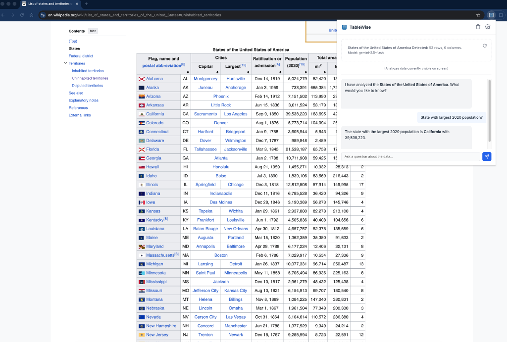

# TableWise Chrome Extension

**TableWise** is a powerful Chrome Extension that allows you to instantly analyze tabular data from any webpage or your clipboard using Google's Gemini AI or a **Local LLM** (via Ollama).

## Screenshots


## Use Cases
- **💰 Financial Research**: Instantly summarize quarterly earnings reports or stock history from news sites.
- **🛒 Product Comparison**: Compare specs, prices, and online reviews in a clean, query-able format.
- **📊 Sports Analytics**: Extract and analyze player statistics from favorite sports websites.
- **🎓 Academic Research**: Quickly digitize and question data tables from web-based PDF viewers or reference materials.

## Features
- **Analyze Page**: Automatically detects and extracts tables (HTML or AG Grid) from the active tab.
- **Analyze Clipboard**: Paste Excel/Sheets data directly to get insights.
- **AI Chat**: Ask questions, get summaries, and identify trends using the integrated chat interface.
- **Local LLM Support**: Connect to Ollama or other OpenAI-compatible local servers for offline analysis.
- **Smart Suggestions**: Context-aware follow-up questions generated automatically.
- **Privacy Focused**: Your API Key is stored locally. Data is sent to the AI provider only when you explicitly analyze it.

## Installation
1. Clone this repository.
2. Open Chrome and navigate to `chrome://extensions`.
3. Enable **Developer Mode** (toggle in top right).
4. Click **Load Unpacked**.
5. Select this folder.

## Setup

### Option A: Google Gemini (Cloud)
1. Click the extension icon and open **Settings** (gear icon).
2. Select **Provider: Google Gemini**.
3. Enter your [Google Gemini API Key](https://aistudio.google.com/app/apikey).
4. Start analyzing!

### Option B: Local LLM (Ollama)
1. Install [Ollama](https://ollama.com).
2. **Important**: You must set `OLLAMA_ORIGINS` to allow the extension to connect.
   Run Ollama with this command:
   ```bash
   # Mac/Linux
   OLLAMA_ORIGINS="*" ollama serve
   
   # Windows (PowerShell)
   $env:OLLAMA_ORIGINS="*"; ollama serve
   ```
3. In TableWise Settings, select **Provider: Local LLM**.
4. Set Base URL to `http://localhost:11434/v1` (default).
5. Enter your model name (e.g., `llama3`, `mistral`, `gemma2`).
6. Click **Check Models** to verify the connection.

## Tech Stack
- Manifest V3
- Vanilla JS / CSS
- Google Gemini API
- OpenAI-Compatible API (for Local LLMs)

## License
MIT
